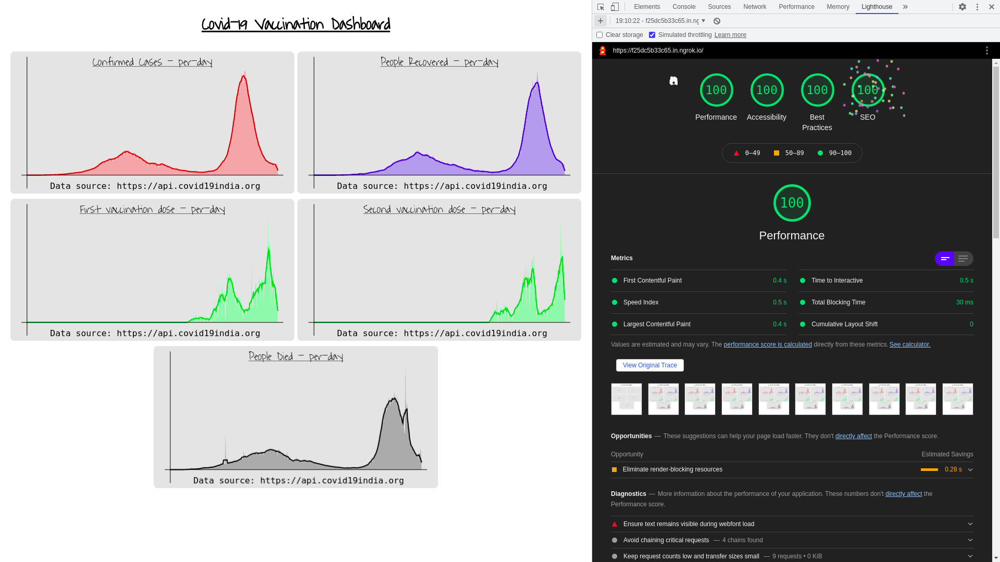

# WebD-Selection
Basic frontend only website project that displays a simple dashboard for simple Covid-19 statistics

# About
This is a basic, very simple website to show you some of the important information about Covid-19 in India

There are multiple hidden elements, the website doesn't consume much of the hardware resources

[SEO](https://developers.google.com/search/docs/beginner/seo-starter-guide) is being well taken care of

The __frames__ are drawn only when there is a change

Most of the work is done manually, no __third-party__ library is harmed other than [p5js](https://p5js.org/)

> More information is available in [./js/Covid19-tracker.js](https://github.com/Mitul16/WebD-Selection/blob/main/js/Covid19-tracker.js)

# Preview

