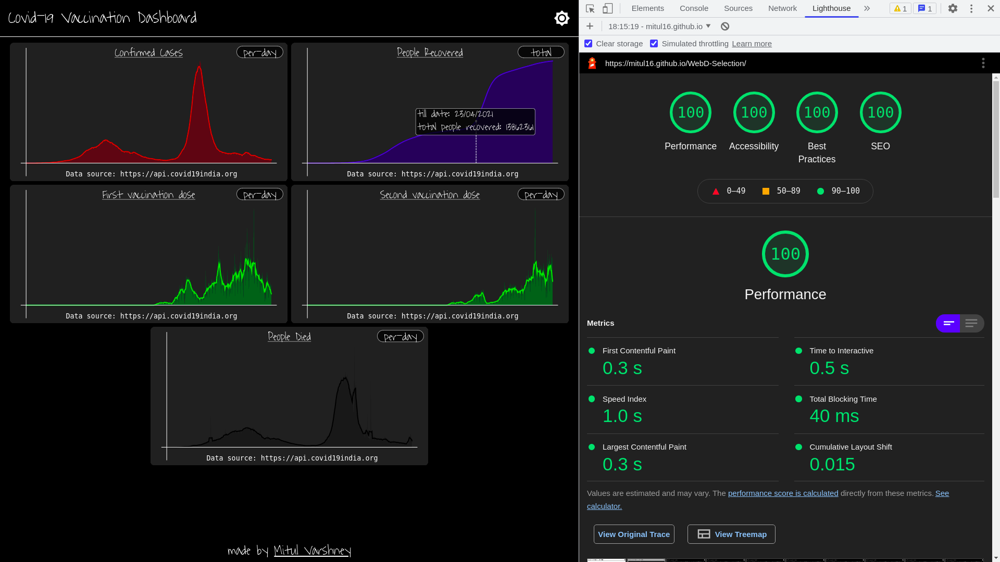

# WebD-Selection
Basic frontend only website project that displays a simple dashboard for simple Covid-19 statistics

Check it out [here](https://mitul16.github.io/WebD-Selection/)

# About
This is a basic, very simple website to show you some of the important information about [Covid-19](https://www.mygov.in/covid-19/) in India

There are multiple hidden elements, the website doesn't consume much of the hardware resources

[SEO](https://developers.google.com/search/docs/beginner/seo-starter-guide) is being well taken care of

The __frames__ are drawn only when there is a change

Most of the work is done manually, no __third-party__ library is harmed other than [p5js](https://p5js.org/)

## Data source
All of the data is being taken from https://api.covid19india.org

# Preview

